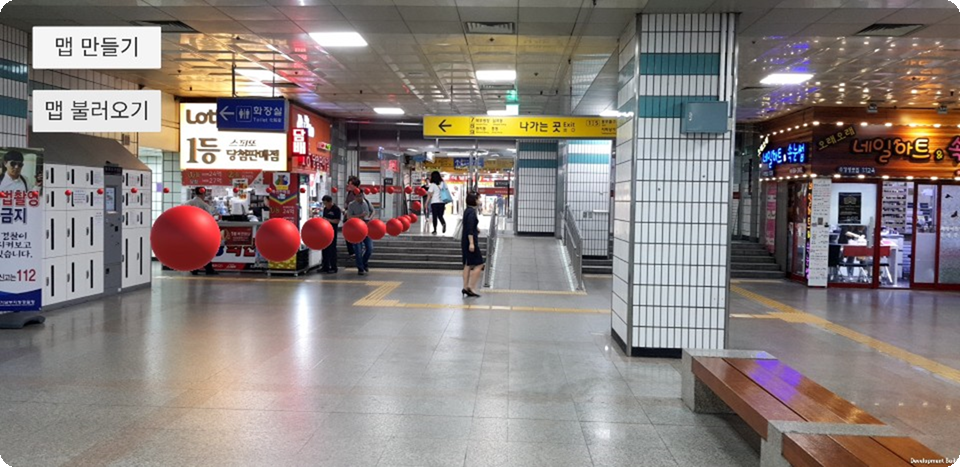

# MaasAR_indoor_navigation(Unity/ARCore)

we participate in 'Seoul Integrated Maas(Mobile as a Service) hackerthon.' 

we couldn't won the prize but, we are in Top 10. 

this is the Work that we made at that time.

basically, it can navigate you with AR.

like this.

